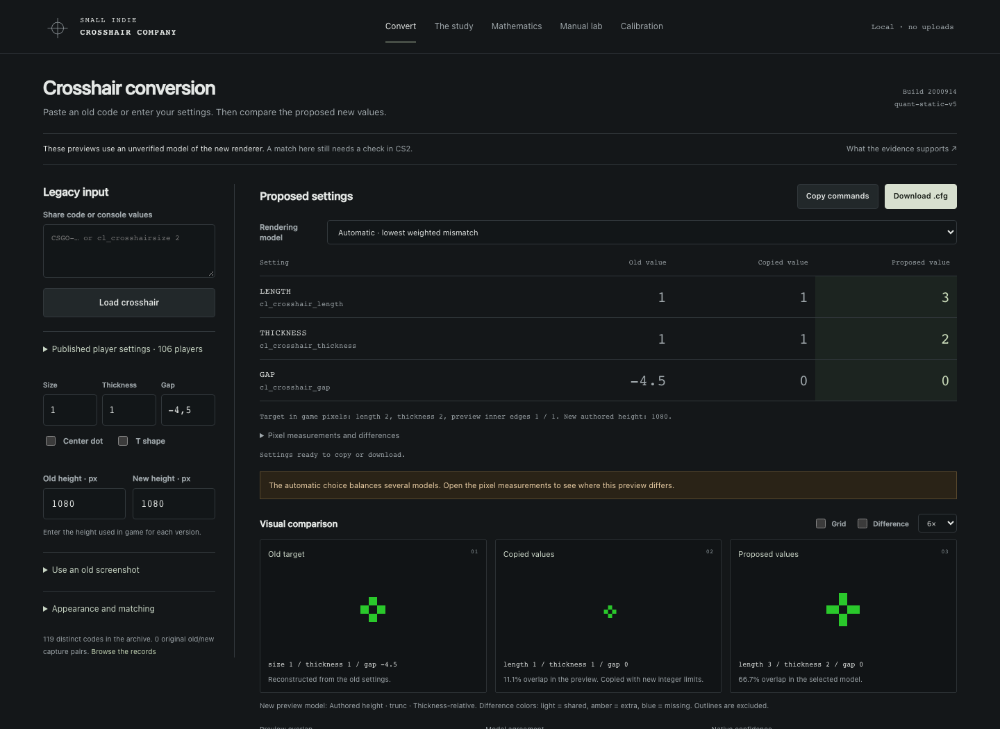
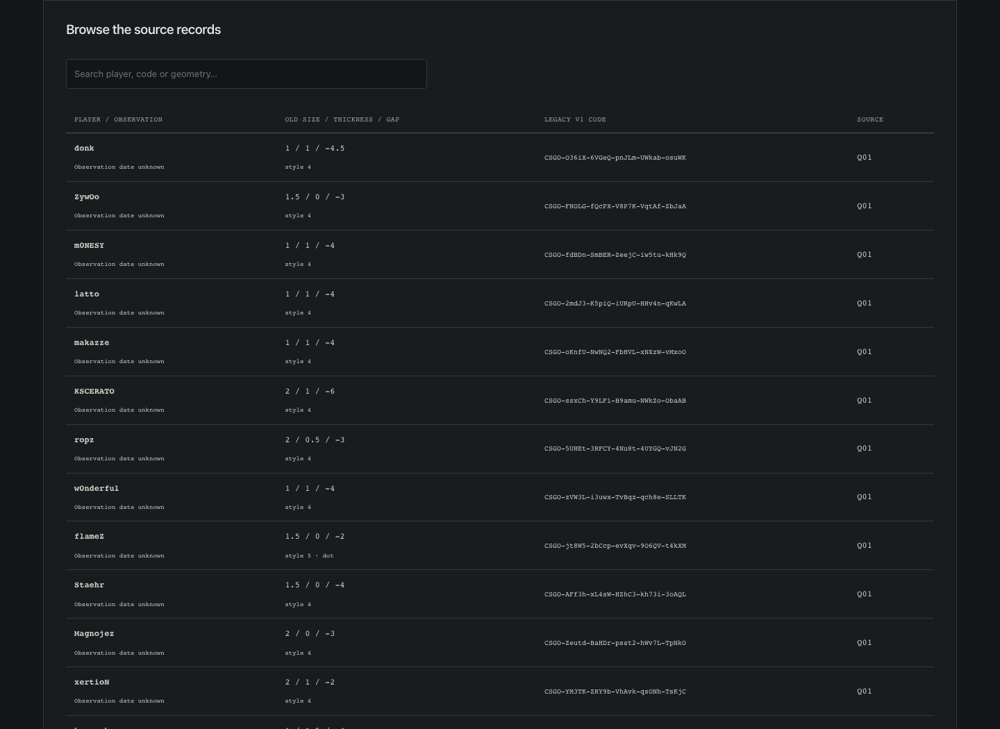
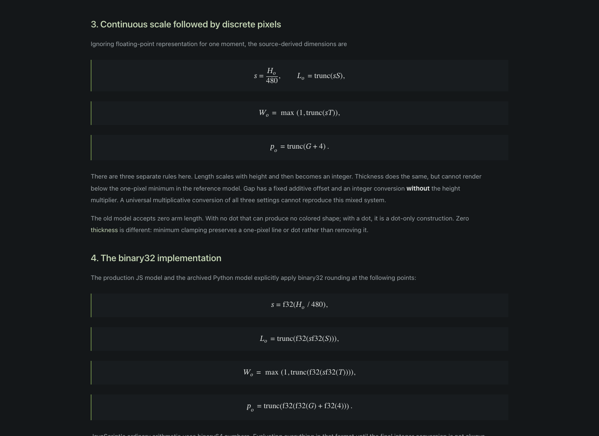
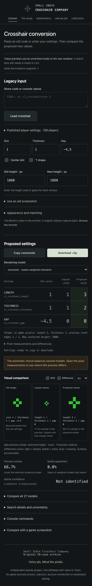

# Small Indie Crosshair Company

**Four lines. One research department.**

Convert old CS2 crosshair settings into proposed new settings, compare the pixels,
and export a config. Runs in your browser; no account, backend, or npm install.

[Run locally](#run-locally) · [Screenshot tour](#screenshot-tour) ·
[Documentation](docs/README.md) · [GitHub Pages setup](docs/engineering/github-pages.md)

> **Before you use the result:** the old renderer is a community reconstruction;
> the new renderers are hypotheses. No original old/new game capture pairs are
> included. A perfect preview match does not establish an in-game match.

Research snapshot: **September 23, 2026** · target build **2000914** ·
automatic model **`quant-static-v5`** · manual model **`conditional-static-v4`**.

## Run locally

Requires Node.js **22.12+**. From this directory:

```sh
npm run dev
```

Open **http://127.0.0.1:4173**. Use a web server rather than opening `index.html`
as a file: the app loads modules, local data, and a worker.

1. Paste a legacy v1 share code or old `cl_crosshair...` settings. You can also
   enter values, choose a published preset, or measure an original PNG.
2. Set the old and new game heights to the resolutions you actually used.
3. Compare the old shape, direct assignment, and proposed conversion.
4. Download the config. The JSON report includes the selected model, assumptions,
   residuals, and search trace.

Static style 4 is supported, including dots and T shapes. Dynamic styles and
weapon-dependent gaps are blocked. Outlines, blending, and recoil motion are
not certified by colored-core matching. New share-code encoding is not implemented;
export uses cvar commands.

## Screenshot tour

These are screenshots of the local app with bundled settings and synthetic
previews. They are not captures from CS2.

### 1. Convert and compare

Edit the old values and compare all three previews at the same scale. Expand the
pixel differences to see where a proposed conversion misses the target.



### 2. Browse the source settings

The preset table links settings to their sources. It contains 138 records for
106 players; only eight records have observation dates. Treat these as historical
inputs, not a list of current pro settings.



### 3. Read the math

The notebook explains the old arithmetic, competing new models, fitting methods,
and unresolved questions. Equations render locally without a math service.



<details>
<summary>Mobile layout</summary>



</details>

## What the numbers mean

The copied-values preview truncates and clamps old numbers to the new ranges.
It does not simulate CS2’s automatic migration.

The converter compares 27 combinations of scaling, rounding, and gap behavior.
You can inspect a single model or rank settings across them. Imported native
measurements can inform model weights within their recorded scope.

A **mask match** measures overlap under a chosen model. **Model agreement** depends
on the chosen models and their weights. Neither is a measured chance of success
in CS2; `nativeMatchProbability` remains `null`. The corpus supplies realistic
old inputs, not observations of the new renderer.

See the [evidence definitions](docs/README.md#evidence-labels),
[solver derivation](docs/math/09-solver-and-integrity.md), and
[formula history](docs/research/formula-evolution.md) for details.

## GitHub Pages demo

The included [Pages workflow](.github/workflows/pages.yml) verifies the project
and deploys `dist/`. It supports repository subpaths without changing asset URLs.
A public demo URL will be added here after a successful deployment.

Follow the [deployment guide](docs/engineering/github-pages.md) to connect a
repository and enable Pages. To preview the same static build locally:

```sh
npm run build
npm run preview
```

## Development

Python **3.10+** is also needed for the archived research checks. Normal development,
verification, and builds have no third-party package dependencies.

```sh
npm run verify              # syntax, research, tests, archive parity, static build
npm run bench:quant         # local solver timing
npm run research:quant      # regenerate the corpus study
npm run research:reproduce  # verify archive hashes and JS/Python parity
```

Optional browser checks and screenshot capture are described in
[testing](docs/engineering/testing.md). For changes and review guidance, see
[CONTRIBUTING](CONTRIBUTING.md) and the [changelog](CHANGELOG.md).

| Directory | Contents |
| --- | --- |
| `lib/` | Pure geometry, conversion, image analysis, and statistics |
| `app/` | Browser controls, canvases, and worker orchestration |
| `data/` | Versioned settings and study results |
| `docs/` | Math, sources, engineering notes, and screenshot tour |
| `research/` | Frozen archive and reproducible experiments |
| `scripts/`, `tests/` | Local tooling and regression checks |

Imports and screenshots stay in the browser unless you export them. There is no
tracking, persistence, or game-process access. See [security and privacy](SECURITY.md).

## License

Original code is [MIT licensed](LICENSE). Third-party code and source attributions
are listed in [THIRD_PARTY_NOTICES](THIRD_PARTY_NOTICES.md). Independent parody
project; not affiliated with Valve or Volvo.
