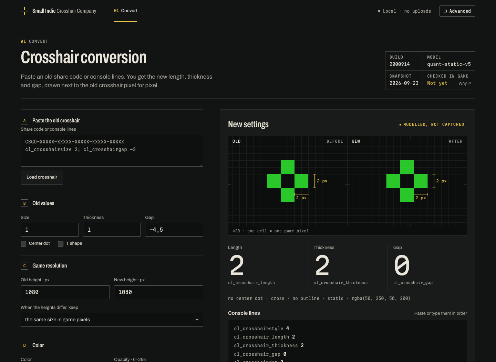
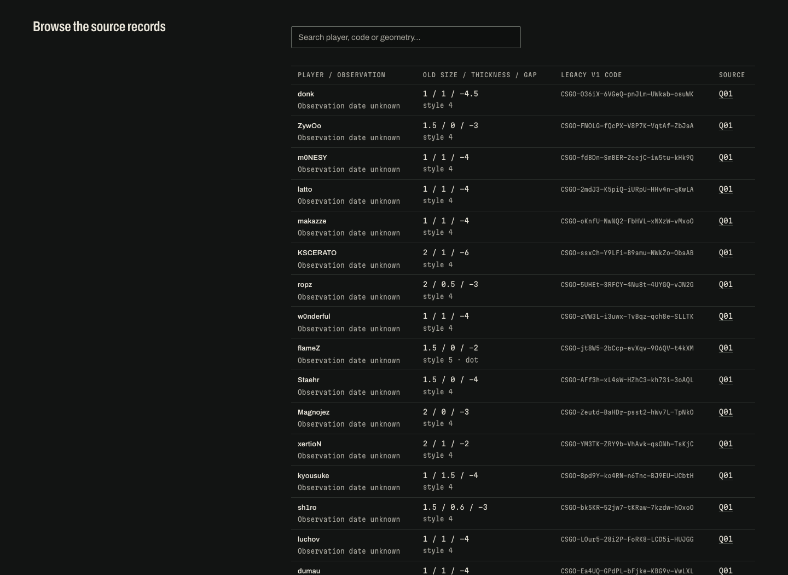
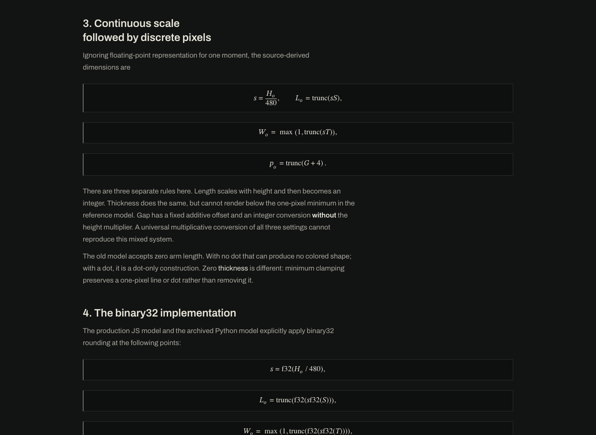
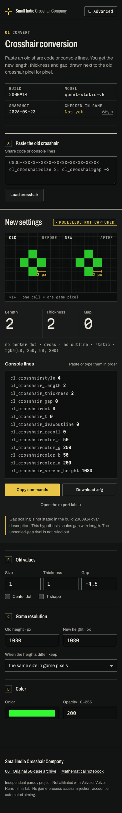

# Small Indie Crosshair Company

Convert old CS2 crosshair settings, compare pixel previews, and export proposed
settings. The app runs in your browser without an account or backend.

[Try the live demo](https://sebastianspicker.github.io/small-indie-crosshair-company/) ·
[Run locally](#run-locally) · [Screenshot tour](#screenshot-tour) ·
[Documentation](docs/README.md) · [GitHub Pages setup](docs/engineering/github-pages.md)

> **Before you use the result:** the old renderer is a community reconstruction;
> the new renderers are hypotheses. No original old/new game capture pairs are
> included. A perfect preview match does not establish an in-game match.

Default model **`community-static-v1`** · inspected build **2000918** ·
[conversion audit, September 28](docs/research/converter-audit-2026-09-28.md).
The September 23 corpus, historical `quant-static-v6` family and manual
`conditional-static-v4` lab remain separate comparisons.

## Run locally

Requires Node.js **22.12+**. From this directory:

```sh
npm run dev
```

Open **http://127.0.0.1:4173**. Use a web server rather than opening `index.html`
as a file: the app loads modules, local data, and a worker.

The app opens in the **Simple** view: paste on the left, the answer on the right.
It shows the old and new crosshair on dimensioned pixel plates, the three new
values, and the console lines to paste or type. Select **Advanced** in the
masthead to open the **Expert** lab with six renderer choices, derivations,
search trace, evidence and measurements. Mode is held only in the page, not
saved to your device. The interface follows your system's light or dark theme.

1. Paste a legacy v1 share code or old `cl_crosshair...` settings. You can also
   enter values, choose a published preset, or measure an original PNG.
2. Set the old and new game heights to the resolutions you actually used.
3. Compare the old shape, direct assignment, and proposed conversion.
4. Download the config. The JSON report includes the selected model, assumptions,
   residuals, and search trace.

Static style 4 is supported, including dots and T shapes. Dynamic styles and
weapon-dependent gaps are blocked. Outlines, blending, and recoil motion are
not certified by colored-core matching. New share-code encoding is not implemented;
export uses cvar commands.

## Screenshot tour

These are screenshots of the local app with bundled settings and synthetic
previews. They are not captures from CS2. The converter screenshot shows the
default **Simple** view; the masthead **Advanced** button expands it into the
Expert lab.

### 1. Convert and compare

Paste a code or edit the old values. The reading panel draws the old and new
crosshair at the same magnification, with their arm length and thickness
dimensioned in game pixels. The Expert lab adds the copied-values preview and the
pixel differences that show where a proposed conversion misses the target.



### 2. Browse the source settings

The preset table links settings to their sources. It contains 138 records for
106 players; only eight records have observation dates. Treat these as historical
inputs, not a list of current pro settings.



### 3. Read the math

The notebook explains the old arithmetic, competing new models, fitting methods,
and unresolved questions. Equations render locally without a math service.



<details>
<summary>Mobile layout</summary>



</details>

## What the numbers mean

The copied-values preview truncates and clamps old numbers to the new ranges.
It does not simulate CS2’s automatic migration.

The default uses a direct, source-labelled static reconstruction with explicit
rounding and pixel placement. Six choices are exposed in the UI. The historical
hedge still compares 27 combinations internally; its imported measurements can
inform model weights only within the matching build. The default instead reports
measurement residuals without invented probabilities.

A **mask match** measures overlap under a chosen model. Historical **model agreement** depends
on the chosen models and their weights. A decision rule (`expected`, `worst`, or
`cvar`) chooses a tuple under that loss; different rules often choose different
natives. Neither is a measured chance of success in CS2; `nativeMatchProbability`
remains `null`. The corpus supplies realistic old inputs, not observations of the
new renderer.

For the historical family, an **opt-in** certificate (`infer({ certify: true })`) can certify the chosen tuple
as the best available under the declared loss, or refuse to claim it. It is a claim
about the declared objective, not about Valve's renderer. The community default
does not claim this certificate. A synthetic **capture plan** lists two crosshairs whose predictions
would separate the 27 hypotheses; it is a plan, not measurements.

See the [evidence definitions](docs/README.md#evidence-labels),
[the current reconstruction](docs/math/12-community-conversion.md),
[the solver derivation](docs/math/09-solver-and-integrity.md),
[the certified inverse and capture plan](docs/math/11-certified-inverse-and-capture-plan.md),
and [formula history](docs/research/formula-evolution.md) for details.

## GitHub Pages demo

The [live demo](https://sebastianspicker.github.io/small-indie-crosshair-company/)
is built and deployed by the [Pages workflow](.github/workflows/pages.yml). It
supports repository subpaths without changing asset URLs.

Follow the [deployment guide](docs/engineering/github-pages.md) to connect a
repository and enable Pages. To preview the same static build locally:

```sh
npm run build
npm run preview
```

## Development

Python **3.10+** is also needed for the archived research checks. Normal development,
verification, and builds have no third-party package dependencies.

```sh
npm run verify              # syntax, research, tests, archive parity, static build
npm run bench:quant         # local solver timing
npm run bench:emulator      # learned-vs-exact timing (research only)
npm run bench:ranker        # learned shortlist + exact verification (research only)
npm run certify:inverse     # certify/refuse the declared optimum per corpus case
npm run study:decision      # compare the expected/worst/cvar decision rules
npm run study:partition     # behavioural partition of the 27 hypotheses
npm run study:discriminating # two-design separating capture plan
npm run research:quant      # regenerate the corpus study
npm run research:reproduce  # verify archive hashes and JS/Python parity
npm run emulator:train      # retrain the research-only learned emulator
npm run emulator:community  # current-target ML feature ablation; grouped validation/test
npm run study:converters    # validate saved external responses and compare converters
```

The current research-only emulator improves exact tuple fidelity from **29.17%
to 90.48%** on the same held-out new-target data by adding authored-height and
geometry features. There are 21 independent setting groups (672 rows); model
capacity is selected on separate validation groups. Full verification retrains
the artifact and rejects drift. This imitates our equations, not CS2; the small
exact solver remains the runtime path. See the [audit](docs/research/converter-audit-2026-09-28.md).

The historical learned emulator is a research artifact only. It is trained offline on labels
from the declared solver, and it measures fidelity to that solver, not accuracy
in CS2. A capacity revision raised its held-out full-tuple fidelity from about
11.6% to about 35.7%; the gain came from capacity, not from the 7 extra declared
features, which were neutral-to-slightly-negative in ablation. Its learned ranker
still lost to the exact solver on 13 of 125 samples, and its learned fragility
classifier was weak (0.736 vs a 0.704 majority baseline), so none of it is part of
the app's conversion path. See
[chapter 10](docs/math/10-learned-emulator.md) and
[chapter 11](docs/math/11-certified-inverse-and-capture-plan.md).

Optional browser checks and screenshot capture are described in
[testing](docs/engineering/testing.md). For changes and review guidance, see
[CONTRIBUTING](CONTRIBUTING.md) and the [changelog](CHANGELOG.md).

| Directory | Contents |
| --- | --- |
| `lib/` | Pure domain: `settings/`, `geometry/`, `image/`, the automatic `solver/`, the `manual/` lab |
| `app/` | Browser runtime: router, one folder per route, the worker boundary |
| `data/` | The bundled JSON the app loads (presets, corpus, study summary) |
| `docs/` | Math, sources, engineering notes, and screenshot tour |
| `research/` | Research-only models and pipelines, generated results, frozen archive |
| `scripts/` | Build, serve, check, and notebook tooling |
| `tests/` | Node tests grouped by tree, plus Python browser checks |

The layering and its rules are described in [architecture](docs/engineering/architecture.md).

Imports and screenshots stay in the browser unless you export them. There is no
tracking, persistence, or game-process access. See [security and privacy](SECURITY.md).

## License

Original code is [MIT licensed](LICENSE). Third-party code and source attributions
are listed in [THIRD_PARTY_NOTICES](THIRD_PARTY_NOTICES.md). Independent parody
project; not affiliated with Valve or Volvo.
